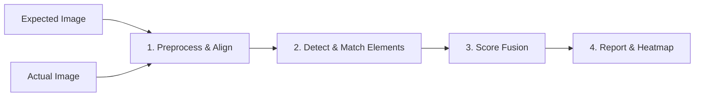

# UI Visual Match Validator

[](https://www.python.org/)

A **layered visual-diff pipeline** that compares an **Expected** UI design mock against an **Actual** screenshot, producing a **confidence score (0–100)** and an annotated visual diff report.

Unlike standard pixel-by-pixel or OCR-based diffing tools which are brittle and fail on minor rendering differences, this tool relies on robust Computer Vision (CV) techniques to validate the **structural layout and design integrity** of a UI. It is content-agnostic and highly tolerant of anti-aliasing and sub-pixel shifts while ruthlessly strict against missing elements or broken layouts.

## Architecture Pipeline



The pipeline passes the images through four distinct layers of comparison.

### Layer A: SSIM (Structural Similarity)
**Weight: 5% | Purpose: Structural Sanity Check**
- **Algorithm:** Computes the Structural Similarity Index Measure (SSIM) after applying a light Gaussian blur.
- **Why we use it:** SSIM evaluates the overall contrast, luminance, and coarse structure rather than absolute pixels. The pre-blur ensures it ignores microscopic sub-pixel rendering and font anti-aliasing noise. It provides a baseline sanity check and generates the visual heatmap diff.

### Layer B: Perceptual Hash (pHash)
**Weight: 5% | Purpose: High-Speed Gatekeeper**
- **Algorithm:** Generates a 64-bit cryptographic-style hash based on the low-frequency macro-structure of the images.
- **Why we use it:** A quick "Are these even the same screen?" check. It heavily penalizes completely different screens (e.g., Login vs. Settings) before running heavier CV layers.

### Layer C: Element Position Matching (PRIMARY LAYER)
**Weight: 65% | Purpose: The Heavy Lifter**
- **Algorithm:** 
  1. **Detection:** Uses OpenCV's Canny edge detector and contour extraction to identify UI elements as bounding boxes.
  2. **Matching:** Pairs Expected elements with Actual elements using the **Hungarian Assignment Algorithm** based on a cost matrix of Intersection over Union (IoU) and Centroid distance.
  3. **Strict Size Gating:** Elements are penalized or rejected if their sizes differ significantly, preventing false matches. It gracefully forgives <50% area jitter caused by text reflows.
  4. **Area-Weighted F1 Score:** Computes Precision and Recall weighted by the bounding box pixel area. This ensures missing a 500x500 hero banner tanks the score, while missing a 5x5 noise artifact is ignored.

### Layer D: Color Matching (PRIMARY LAYER)
**Weight: 25% | Purpose: Thematic & Element Color Integrity**
- **Algorithm:**
  1. **Per-Element:** For every matched pair in Layer C, uses K-Means clustering to extract the dominant color. Compares them using **Delta-E (CIE2000) in the Lab color space**—which mathematically models human color perception, unlike raw RGB.
  2. **Global Histogram:** Compares the whole-image color histogram to catch global theme-level mismatches (e.g., dark mode vs light mode).

### Stage 3: Score Fusion & The "Structural Gate"
The scores from all four layers are blended using their respective weights. However, to prevent purely additive scores from artificially inflating mismatched UIs (e.g., two different pages scoring 50% just because they share a white background), we employ a **Structural Gate (The Kill Switch)**:
- If the core layout matching (Position F1 Score) falls below `60%`, the layout is considered fundamentally broken, and the final score is mathematically crushed toward `0`.

> **Note:** Text/OCR is intentionally never part of the default score. If "Learn React" changes to "Learn React Hooks", the bounding box merely gets slightly wider. The tool recognizes the structural block is still there and scores it as a success, remaining entirely content-agnostic.

---

## Installation

```bash
cd ui-diff
pip install -e ".[dev]"
```

### Optional extras
```bash
pip install -e ".[dom]"       # Playwright DOM ground-truth bounding boxes
pip install -e ".[semantic]"  # CLIP semantic layer (Phase 2)
```

## Usage

### CLI

```bash
ui-diff compare expected.png actual.png \
  --config config/default_weights.yaml \
  --ignore-regions ignore.json \
  --output report.json \
  --diff-image diff.png \
  --threshold 85
```

Exit code `0` = passes threshold, `1` = below threshold, `2` = input error.

### Python Library

```python
from ui_diff import compare

result = compare("expected.png", "actual.png", config="config/default_weights.yaml")
assert result.confidence_score >= 85
assert not result.has_critical_failures

print(result.confidence_score)   # e.g. 87.4
print(result.layers)             # {"ssim": 0.91, "phash": 0.95, "position_match": 0.84, "color_match": 0.88}
print(result.issues)             # list of detected problems
```

## Configuration
All weights and thresholds live in `config/default_weights.yaml` — **never hardcoded**. 
You can define custom weights, adjust Canny thresholds, modify Delta-E sensitivity, and define regions to ignore (e.g. dynamic ads or avatars).

## Running Tests

```bash
pytest tests/ -v
```

Tests use programmatic fixture image factories to ensure deterministic CI execution.
